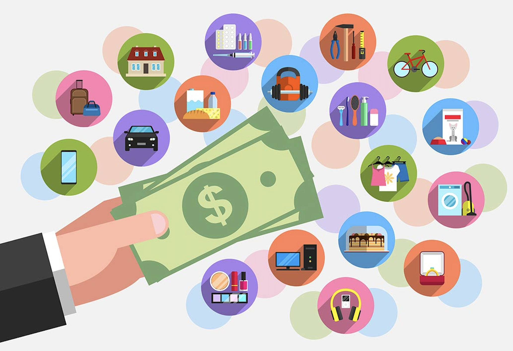

# Data Visualization Portfolio

## About Me

Welcome to my data visualization portfolio! My name is Filip Puzic, and I’m a student passionate about data, economics, and design. I enjoy translating raw datasets into visual stories that inform, persuade, and spark curiosity. My skills include Python programming, data cleaning, visualization, and infographic design using tools like Plotly, Folium, Matplotlib, Canva, and Recraft.

I'm especially interested in topics at the intersection of finance, public policy, and sustainability. My career goals involve working in data-driven roles where I can apply my technical and analytical skills to create real-world impact.

<!-- Update these links with your actual profiles/documents -->
To learn more about me, you can visit my [personal website](your_web_address), check out my [GitHub](https://github.com/YOURACCOUNT), or read my [CV](Images/CV.pdf).

---

## Project 1: Recreate and Remix — S&P 500 Candlestick Visualization

<table align="left" style = "border-collapse: collapse; border: none;">
    <tr style = "border: none;">
        <td style="padding: 10px; width:25%; border: none;"> 
            
        </td>
        <td style="padding:10px; width:75%; border: none;" valign = "top">
            

            This project involved recreating a financial candlestick chart from TradingView using Python and Plotly, then remixing it with added insights and interactivity. I enhanced the visualization with technical indicators such as Bollinger Bands, a 200-day moving average, and OHLC tooltips to make it more informative and user-friendly. <a href="./Remix/README.md">Learn more</a>
              
            <i>Tools used: Python, Pandas, Plotly, Jupyter Notebook</i>
            

        </td>
    </tr> 
</table>

---

## Project 2: The EV Revolution — Why It’s Time to Go Electric

<table align="left" style = "border-collapse: collapse; border: none;">
    <tr style = "border: none;">
        <td style="padding: 10px; width:25%; border: none;"> 
            
        </td>
        <td style="padding:10px; width:75%; border: none;" valign = "top">
            

            This infographic explores the geographic spread of EV charging infrastructure in the U.S. using layered radius maps. It argues for the viability of switching to electric vehicles by visualizing access to chargers within 4, 20, and 100-mile radii. This project combined mapping, spatial data, and clean design to support a data-driven argument for electrification. <a href="./The EV Revolution/README.md">Learn more</a>
              
            <i>Tools used: Python, Pandas, Folium, Shapely, Canva</i>
            

        </td>
    </tr> 
</table>

---

## Project 3: Where Does $1 of Income Go?

<table align="left" style = "border-collapse: collapse; border: none;">
    <tr style = "border: none;">
        <td style="padding: 10px; width:25%; border: none;"> 
            
        </td>
        <td style="padding:10px; width:75%; border: none;" valign = "top">
            

            This project visualizes how average U.S. households earning under $50K and over $200K allocate each dollar of income. By using pie charts and concise commentary, it highlights stark contrasts in spending priorities and financial flexibility between income groups. The visual helps users quickly grasp how essentials dominate low-income budgets, while high earners can afford more saving and planning. <a href="./Where Does $1 of Income Go?/README.md">Learn more</a>
              
            <i>Tools used: Python, Matplotlib, Canva</i>
            

        </td>
    </tr> 
</table>
